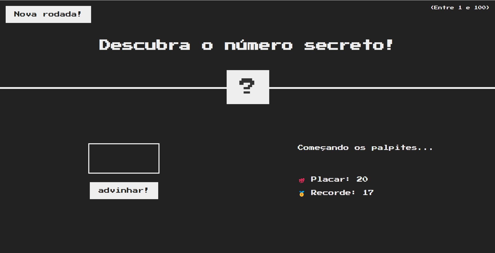
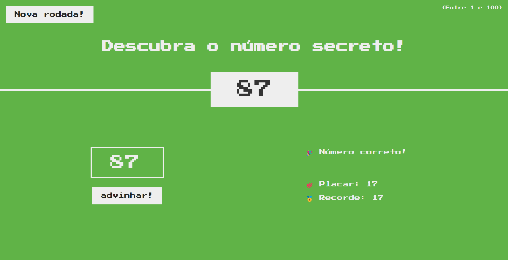
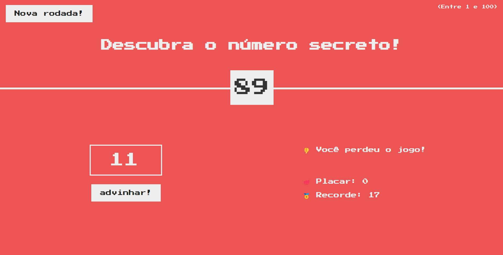

# Descubra o Número

## Descrição

"Descubra o Número" é um jogo simples e divertido onde o jogador tenta adivinhar um número secreto entre 1 e 100. O jogo oferece feedback para cada tentativa, informando se o palpite do jogador é muito alto ou muito baixo. O jogador tem até 20 tentativas para adivinhar o número correto.

## Regras do Jogo

1. O número secreto é um valor aleatório entre 1 e 100.💯
2. O jogador tem no máximo 20 tentativas para adivinhar o número. 😬
3. Se o jogador não conseguir adivinhar o número dentro de 20 tentativas, ele perde o jogo. 👎

## Como Jogar

1. Ao iniciar o jogo, um número secreto é gerado aleatoriamente.
2. O jogador insere um palpite e clica em "Enviar".
3. O jogo fornece feedback indicando se o palpite é muito alto ou muito baixo.
4. O jogador continua tentando até adivinhar o número correto ou até esgotar as 20 tentativas.

## Capturas de Tela





## Tecnologias Utilizadas

- HTML 🩻
- CSS 🎨
- JavaScript 💪

## Instalação e Uso

Para executar o jogo localmente, siga estas etapas:

1. Clone este repositório:
   ```sh
   git clone https://github.com/oadluis/descubra-o-numero.git

## Contato

Para mais informações, entre em contato pelo email: andre.barbosa.1390@gmail.com.
